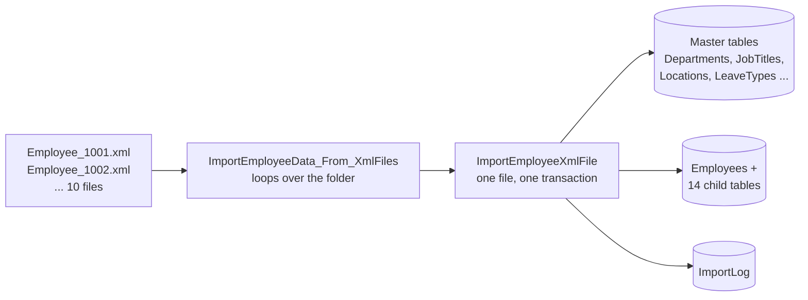
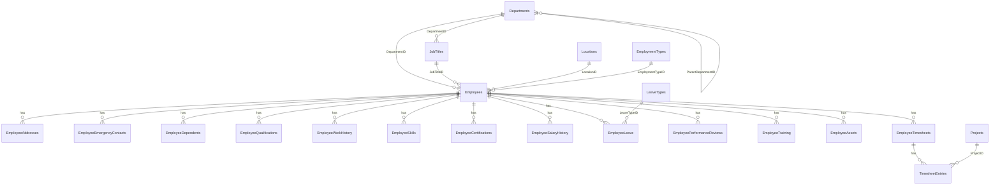

# Bulk XML Import for SQL Server


A T-SQL project that bulk-loads **XML files** (demo data set: employee records) into a **normalised HR database**.
Point one stored procedure at a folder and every `*.xml` file is shredded into 22 related tables
(Employees, Departments, Job Titles, Locations, Leave, Salary history, Timesheets and more) with full
error handling and an audit log.

- **One transaction per employee** - a bad file never leaves half-imported data behind
- **Master data is created automatically** - new Departments, Job Titles, Locations, Leave Types and Projects found in a file are added and linked with foreign keys
- **Re-runnable** - importing the same file again replaces that employee cleanly (`ON DELETE CASCADE`)
- **Batch import from a folder** without enabling `xp_cmdshell`
- **Audit trail** in `dbo.ImportLog` (Success / Skipped / Failed, rows written, error message)
- Ships with **10 realistic sample XML files** and a **verification script**

---

## How it works



| Step | What happens |
|------|--------------|
| 1 | The folder is listed with `xp_dirtree`; each file is passed to `ImportEmployeeXmlFile` |
| 2 | The file is read with `OPENROWSET(BULK ..., SINGLE_BLOB)` and cast to `XML` (declared encoding is honoured) |
| 3 | `EmployeeNo` is read; files without one are **skipped** |
| 4 | Department, Job Title, Location, Employment Type, Leave Types and Projects are *get-or-created* |
| 5 | `Employees` and 14 child sections are inserted with `.nodes()` / `.value()` inside one transaction |
| 6 | Timesheet header rows and their entries are linked exactly using `MERGE ... OUTPUT` (no dependence on row order) |
| 7 | The result is written to `dbo.ImportLog` |

---

## Database model



| Group | Tables |
|-------|--------|
| **Master / lookup (6)** | `Departments`, `JobTitles`, `Locations`, `EmploymentTypes`, `LeaveTypes`, `Projects` |
| **Parent (1)** | `Employees` |
| **Child (14)** | `EmployeeAddresses`, `EmployeeEmergencyContacts`, `EmployeeDependents`, `EmployeeQualifications`, `EmployeeWorkHistory`, `EmployeeSkills`, `EmployeeCertifications`, `EmployeeSalaryHistory`, `EmployeeLeave`, `EmployeePerformanceReviews`, `EmployeeTraining`, `EmployeeAssets`, `EmployeeTimesheets`, `TimesheetEntries` |
| **Support (1 + 1 view)** | `ImportLog`, `vw_EmployeeOverview` |

`EmploymentTypes`, `LeaveTypes` and eight common `Departments` are seeded by the create script.

---

## Repository layout

```
BulkXmlImport/
├── README.md
├── LICENSE
├── sql/
│   ├── 01_Create_Employee_Tables.sql            # database, 22 tables, seed data, view
│   ├── 02_ImportEmployeeXmlFile.sql             # imports ONE xml file
│   ├── 03_ImportEmployeeData_From_XmlFiles.sql  # imports a whole FOLDER
│   └── 04_Run_And_Verify.sql                    # run + row counts + sample reports
├── sample-data/xml/
│   └── Employee_1001.xml ... Employee_1010.xml  # 10 fictional employees
├── tools/
│   └── generate_sample_xml.py                   # regenerates the sample files
└── docs/
    └── Bulk_XML_Import_Project_Overview.pdf
```

---

## Quick start

**Requirements:** SQL Server 2016 SP1 or later (Developer/Express is fine), SSMS or Azure Data Studio.

1. **Copy the XML files** from `sample-data/xml` to a folder on the *SQL Server machine*, e.g. `C:\BulkXmlImport\xml`.
   The SQL Server service account needs read access to that folder.
2. **Run the scripts in order** (each one is re-runnable):

   ```text
   sql/01_Create_Employee_Tables.sql
   sql/02_ImportEmployeeXmlFile.sql
   sql/03_ImportEmployeeData_From_XmlFiles.sql
   ```
3. **Import the folder:**

   ```sql
   USE EmployeeDB;
   EXEC dbo.ImportEmployeeData_From_XmlFiles
        @FolderPath = N'C:\BulkXmlImport\xml';
   ```
4. **Check the results** with `sql/04_Run_And_Verify.sql`.

### Procedure parameters

| Procedure | Parameter | Default | Meaning |
|-----------|-----------|---------|---------|
| `ImportEmployeeData_From_XmlFiles` | `@FolderPath` | - | Folder containing the XML files |
| | `@FilePattern` | `%.xml` | `LIKE` pattern for file names |
| | `@ReplaceExisting` | `1` | `1` = replace existing employee, `0` = skip it |
| | `@StopOnError` | `0` | `1` = stop at the first failed file |
| `ImportEmployeeXmlFile` | `@FilePath` | - | Full path of one XML file |
| | `@ReplaceExisting` | `1` | As above |
| | `@RunID` | `NEWID()` | Groups log rows of one batch |

`ImportEmployeeXmlFile` returns `0` = success, `1` = skipped, `2` = failed.

---

## XML format

Each file holds one employee. `Demographics` appears once; every other section can repeat or be omitted.

```xml
<?xml version="1.0" encoding="utf-8"?>
<Employee>
  <Demographics>
    <EmployeeNo>1003</EmployeeNo>
    <FirstName>José</FirstName>
    <LastName>Álvarez</LastName>
    <HireDate>2021-01-11</HireDate>
    <TerminationDate />                      <!-- empty tag -> NULL, not 1900-01-01 -->
    <Department>Engineering</Department>     <!-- created automatically if new -->
    <JobTitle>DevOps Engineer</JobTitle>
    <WorkLocation>Berlin</WorkLocation>
    <EmploymentType>Full-time</EmploymentType>
    <ManagerEmployeeNo>1001</ManagerEmployeeNo>
  </Demographics>
  <Skill><SkillName>Docker</SkillName><ProficiencyLevel>Expert</ProficiencyLevel></Skill>
  <Leave><LeaveType>Annual</LeaveType><StartDate>2026-03-02</StartDate><Days>5.0</Days></Leave>
  <Timesheet>
    <WeekStartDate>2026-06-01</WeekStartDate>
    <Entry><WorkDate>2026-06-01</WorkDate><ProjectCode>PRJ-1001</ProjectCode><Hours>8.00</Hours></Entry>
  </Timesheet>
</Employee>
```

| XML element | Target table | Repeats |
|-------------|--------------|---------|
| `Demographics` | `Employees` (+ master tables) | once |
| `Address` | `EmployeeAddresses` | yes |
| `EmergencyContact` | `EmployeeEmergencyContacts` | yes |
| `Dependent` | `EmployeeDependents` | yes |
| `Qualification` | `EmployeeQualifications` | yes |
| `WorkHistory` | `EmployeeWorkHistory` | yes |
| `Skill` | `EmployeeSkills` | yes |
| `Certification` | `EmployeeCertifications` | yes |
| `SalaryHistory` | `EmployeeSalaryHistory` | yes |
| `Leave` | `EmployeeLeave` (+ `LeaveTypes`) | yes |
| `PerformanceReview` | `EmployeePerformanceReviews` | yes |
| `Training` | `EmployeeTraining` | yes |
| `Asset` | `EmployeeAssets` | yes |
| `Timesheet` > `Entry` | `EmployeeTimesheets` > `TimesheetEntries` (+ `Projects`) | yes |

---

## Sample data

The 10 sample files are fictional and deliberately varied to exercise edge cases:

- a **terminated** employee (`1009`) and one **on leave** (`1006`)
- **new master data** created on import (departments *Executive* and *Data & Analytics*, locations, job titles)
- **empty tags**, employees with **no dependents** or **no work history**
- **special characters**: `O'Connor`, `José Álvarez`, `Zoë`, `&` and `<internal>` (escaped in XML)

Expected contents after importing all 10 files:

| Table | Rows | Table | Rows |
|-------|-----:|-------|-----:|
| Employees | 10 | EmployeeSalaryHistory | 68 |
| EmployeeAddresses | 13 | EmployeeLeave | 35 |
| EmployeeEmergencyContacts | 16 | EmployeePerformanceReviews | 25 |
| EmployeeDependents | 6 | EmployeeTraining | 32 |
| EmployeeQualifications | 22 | EmployeeAssets | 21 |
| EmployeeWorkHistory | 18 | EmployeeTimesheets | 18 |
| EmployeeSkills | 37 | TimesheetEntries | 90 |
| EmployeeCertifications | 19 | **Total (employee data)** | **430** |

Regenerate or extend the data set: `python tools/generate_sample_xml.py`

---

## Example queries

```sql
-- Overview of every employee (department, title, manager, latest salary, rating)
SELECT * FROM dbo.vw_EmployeeOverview ORDER BY EmployeeNo;

-- Headcount by department
SELECT d.DepartmentName, COUNT(*) AS Headcount
FROM dbo.Employees e JOIN dbo.Departments d ON d.DepartmentID = e.DepartmentID
WHERE e.Active = 1 GROUP BY d.DepartmentName ORDER BY Headcount DESC;

-- Hours per project
SELECT p.ProjectCode, p.ProjectName, SUM(te.Hours) AS TotalHours
FROM dbo.TimesheetEntries te JOIN dbo.Projects p ON p.ProjectID = te.ProjectID
GROUP BY p.ProjectCode, p.ProjectName ORDER BY TotalHours DESC;

-- What happened in the last import?
SELECT TOP (20) * FROM dbo.ImportLog ORDER BY LogID DESC;
```

More reports are in `sql/04_Run_And_Verify.sql`.

---

## Design decisions

| Topic | Approach |
|-------|----------|
| Atomicity | `SET XACT_ABORT ON` + `TRY/CATCH` + one transaction per file |
| Re-import | `DELETE FROM Employees` cascades to all child tables |
| Empty values | `TRY_CONVERT(... NULLIF(value, ''))` - an empty tag becomes `NULL`, never `1900-01-01` or `0` |
| Parent/child rows | `MERGE ... ON 1 = 0 ... OUTPUT` pairs each new `TimesheetID` with its XML fragment |
| Master data | Get-or-create by name, so new departments or titles never break an import |
| Manager link | `ManagerEmployeeNo` is a soft reference, so files can be imported in any order |
| Folder listing | `xp_dirtree` - no need to enable `xp_cmdshell` |
| Security | File path is escaped before it enters the dynamic `OPENROWSET` statement |

## Troubleshooting

| Symptom | Fix |
|---------|-----|
| `Cannot bulk load ... file does not exist or access denied` | The path is resolved **on the SQL Server machine**; grant its service account read access |
| `You do not have permission to use the bulk load statement` | Grant `ADMINISTER BULK OPERATIONS` to the login |
| `No files matching "%.xml" found` | Check the folder path and that the files are not in a sub-folder |
| A file shows `Failed` in `ImportLog` | Read the `Message` column; the rest of the batch still completed |
| Values in a new tag are missing | Add the tag to the import procedure and target table (see below) |

## Extending

To import a new section, add the table to `01_...sql`, then add one `INSERT ... FROM @XmlData.nodes('/Employee/YourSection')`
block to `ImportEmployeeXmlFile` following the pattern of the existing sections.

## Author

**Senthil P N.** - SQL / Database Expert (T-SQL, ETL, Excel VBA / MS Access, .NET)

- Upwork: [www.upwork.com/freelancers/~01c150aa3ba104e1df](https://www.upwork.com/freelancers/~01c150aa3ba104e1df)
- Email: [senpnathan@gmail.com](mailto:senpnathan@gmail.com)

## License

MIT - see [LICENSE](LICENSE). All sample people and data are fictional.
